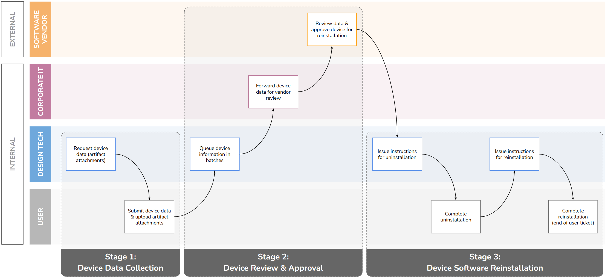

# daml-software-reinstall-compliance

*Case study on how the open-source [Daml smart contract language](https://docs.daml.com/) could be used to improve a real-world software incident management event involving multiple companies and compliance tracking.*

 

## Business Scenario

An unexpected error accessing a network license server **prevented 130 globally distributed employees from accessing a core software, halting business-critical operations**.

A full uninstallation and reinstallation was the only known recourse, but had been prohibited due to a coincidental, ongoing audit by the software vendor to check for compliant use of purchased licenses.

A solution agreed between parties was to collect device data (local environment details), seek device-based approval from the software vendor to make modifications, and only then perform the necessary reinstallation.

 

This resolution workflow required a combination of Jira, Google Sheets, Google Drive, AWS S3, and PowerShell to manage data collection and approval status for each employee, **resulting in over 200 hours of work to manually exchange compliance information between parties and platforms**. 

 

*Multi-party workflow to resolve software outage, including compliance review and approval by software vendor:*

 
 

## Smart Contract Solution

To implement a Smart Contract solution in Daml, 3 contract templates are created to reflect general milestones in the overall process:
1. Device Data Collection
2. Device Review & Approval
3. Device Software Reinstallation

Each contract is recreated to represent updated data such as status changes, while completing a milestone triggers the creation of the next related contract type.

 

<table>
    <thead>
        <tr>
            <th>Contract Templates</th>
            <th>Parties</th>
            <th>Data</th>
        </tr>
    </thead>
    <tbody>
        <tr>
            <td width="33%"><code>DeviceData</code>  <code>DeviceApproval</code>  <code>DeviceReinstallation</code></td>
            <td width="33%"><code>User</code>  <code>Design Tech</code>  <code>Corp. IT</code>  <code>Software Vendor</code></td>
            <td width="34%" ><code>UserDetails</code>  <code>DeviceDataStatus</code>  <code>DeviceApprovalStatus</code>  <code>DeviceReinstallationStatus</code>  <code>Approvers</code></td>
        </tr>
    </tbody>
</table>

 

A script within the module [`SoftwareReinstallCompliance.daml`](https://github.com/williamlewis/daml-software-reinstall-compliance/blob/main/daml/SoftwareReinstallCompliance.daml) executes this full sequence for an example user.

By channeling the user status tracking into a chain of smart contracts, the dissemination of information is automated, approvals can be sequenced and trusted across parties, and a clear history of actions remains immutable for future compliance efforts.

 
 

**References**

[**Daml**](https://docs.daml.com/high-level-intro.html#key-architectural-concepts-in-daml) smart contract language, originated by [Digital Asset](https://www.digitalasset.com/)